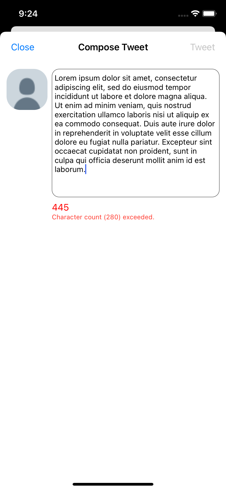

# Project 2 - Twitter Clone

Twitter Clone is a basic twitter app to read and compose tweets the [Twitter API](https://apps.twitter.com/).

Time spent: 20 hours spent in total

## User Stories

The following **core** features are completed:

**A user should**

- [x] See an app icon in the home screen and a styled launch screen
- [x] Be able to log in using their Twitter account
- [x] See at latest the latest 20 tweets for a Twitter account in a Table View
- [x] Be able to refresh data by pulling down on the Table View
- [x] Be able to like and retweet from their Timeline view
- [x] Only be able to access content if logged in
- [x] Each tweet should display user profile picture, username, screen name, tweet text, timestamp, as well as buttons and labels for favorite, reply, and retweet counts.
- [x] Compose and post a tweet from a Compose Tweet view, launched from a Compose button on the Nav bar.
- [x] See Tweet details in a Details view
- [x] App should render consistently all views and subviews in recent iPhone models and all orientations

The following **stretch** features are implemented:

**A user could**

- [x] Be able to **unlike** or **un-retweet** by tapping a liked or retweeted Tweet button, respectively. (Doing so will decrement the count for each)
- [x] Click on links that appear in Tweets
- [x] See embedded media in Tweets that contain images or videos
- [x] Reply to any Tweet (**2 points**)
  - Replies should be prefixed with the username
  - The `reply_id` should be set when posting the tweet
- [x] See a character count when composing a Tweet (as well as a warning) (280 characters) (**1 point**)
- [x] Load more tweets once they reach the bottom of the feed using infinite loading similar to the actual Twitter client
- [x] Click on a Profile image to reveal another user's profile page, including:
  - Header view: picture and tagline
  - Basic stats: #tweets, #following, #followers
- [x] Switch between **timeline**, **mentions**, or **profile view** through a tab bar (**3 points**)
- [x] Profile Page: pulling down the profile page should blur and resize the header image. (**4 points**)

The following **additional** features are implemented:

- [x] Disable "Tweet" button if composition exceeds character count, preventing user from making invalid tweet
- [x] Add replies feed to Details view

Please list two areas of the assignment you'd like to **discuss further with your peers** during the next class (examples include better ways to implement something, how to extend your app in certain ways, etc):

1. Better way to abstract away API requests (ie. template method for POST, GET)
2. Segues vs. delegate view controllers, pros and cons of either navigation approach

## Video Walkthrough
The first video is a quick demo of most of the app's features. The image shows the warning that appears when composition exceeds the accepted character count. The second video demonstrates the ability to handle different orientations and the refresh feature. The third video shows all the remaining stretch features.

 

 

## Notes
While the app's layout should function on most devices, some devices were not simulated and thus may not display entirely as intended. 

## Credits
- [AFNetworking](https://github.com/AFNetworking/AFNetworking) - networking task library
- [DateTools](https://github.com/MatthewYork/DateTools) - tools for date formatting

## License

    Copyright 2022 Catherine Lu

    Licensed under the Apache License, Version 2.0 (the "License");
    you may not use this file except in compliance with the License.
    You may obtain a copy of the License at

        http://www.apache.org/licenses/LICENSE-2.0

    Unless required by applicable law or agreed to in writing, software
    distributed under the License is distributed on an "AS IS" BASIS,
    WITHOUT WARRANTIES OR CONDITIONS OF ANY KIND, either express or implied.
    See the License for the specific language governing permissions and
    limitations under the License.
